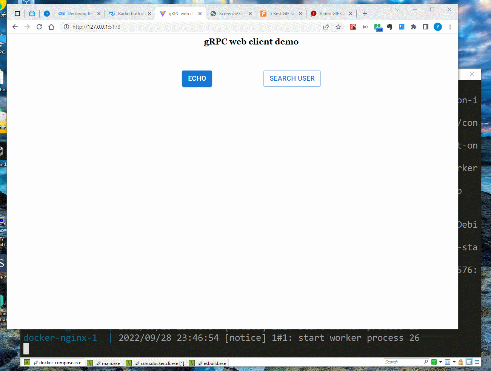

# gRPC-web simple demo

This is a simplest echo request/response gRPC example. 

Due to the JavaScript code( HTTP v1) wouldn't post data to gRPC server by HTTP version 2, You have to use proxy to delegated the request of client, there are two proxy software one is `Envoy` and other is `Nginx`. we are using the second one for two consideration.
	1. Nginx is more famous than Envoy.
	2. Nginx's configuration is simpler than Envoy and has lot of documents and samples. 


## Server side

The gRPC server's duty is echo back the message which send from client and plus the prefix `Hello` that as the reply. 

To activate the server, you can run

```shell

 $ go run cmd/server/main.go

```

> NOTE:
> By default server listen on the tcp port 8090, but you can specified 
> the `-port` parameter flag as needed. 

## Proxy

The proxy is mandatory of the infrastructure of gRPC-web. we are running the proxy in the docker container

```shell

 $  cd docker
 $  docker-compose up

```

> NOTE:
> we are mapping the `conf.d/grpc_proxy.conf` as the additional configuration file of the nginx container. you can modify as your needs. Keep in mind , restart the docker by press `Ctrl + c` to kill the docker-compose process, and rerun it.


## Client side

If you want modified the code in `cmd/client/echo_client.js`, you have to use `webpack` to rebuild the minimal js version. 

Use webpack in the js folder. 

```shell
  $ npx webpack echo_client.js
```

We put the client html files of directory mapping to the volume of the nginx docker container. You need copy the `index.html` and `dist` to the `docker/html` which is the nginx document root from which serve to.


## The next...

We'll use react to write a new `index.html` page with input form and submit button. You are post the message that you inputed.


## The new unary gRPC find user example




go to the `cmd\client\grpc-react-app` folder, use **npm install** install all the package dependencies.

```shell
  $ npm install
  $ npm run dev
```
and open the browser typed the link that the terminal showed.

I wrote a new example which has two unary gRPC request. 

> NOTE: due to `protoc-gen-grpc-web` command can only produces the *commonJS* syntax, You have to do some modification manually to convert the *commonJS* to **ES2016** or **ESM** syntax if you are using `React` frontend framework.
> 1st , I am use the `cjs-to-es6` javascript utility command to convert most of **`require()`** to **`import`** , and **`module.exports`** to **`export default`**. But with one exception, the `cjs-to-es6` command cannot convert the `object.attribute = require()` syntax. My solution is:
> * declare a new const variable name to `require()` 
> ```javascript
>   const grpc = {};
>   grpc.web = require('grpc-web');
> ```
> * and extends the object.attribute
> ```javascript
>   const grpc = {};
>   const web = require('grpc-web');
>   grpc.web = web
> ```
> * after this modification, run the `cjs-to-es6` again

There is final result.

```javascript
const grpc = {};
- grpc.web = require('grpc-web');
+ import web from 'grpc-web';
+ grpc.web = web;

import user_v1_user_pb from '../../user/v1/user_pb.js';
const proto = {};
proto.grpc_web_demo = {};
proto.grpc_web_demo.user = {};
- proto.grpc_web_demo.user.v1  = require('./user_service_pb.js');
+ import v1 from './user_service_pb.js';
+ proto.grpc_web_demo.user.v1 = v1 
``` 

### to be continue...

The next step , I will put all of applications to three different docker image. One for frontend , one for the gRPC proxy, and the last one for gRPC server.